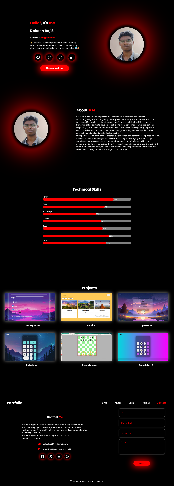

# 🌟 Rakesh's Personal Portfolio Website 🚀

Welcome to my **first ever portfolio website**, where style meets skill! 🎯  
Built with 💖 HTML, 🎨 CSS, ⚙️ JavaScript, and sprinkled with animation magic ✨  
It’s my digital resume, project gallery, and creative playground all in one!

---

## 📸 Image Preview  
 <!-- replace with actual image path if needed -->

---

## 🎥 YouTube Video Walkthrough  
Check out the full walkthrough of the site here 👇  
📺 [Watch on YouTube](https://youtu.be/UN6ZzFsRQtw)

---

## 🌐 Live Demo  
Wanna see it live in action? Tap the link below ⬇️  
🔗 [Visit the Live Site](https://rakesh12531.github.io/portfolio-project/)

---

## ✨ Features  
💫 Animated Scroll Effects with AOS  
⌨️ Dynamic Typing Effect with Typed.js  
💼 Project Gallery with Images  
📞 Contact Section with Input Form  
🎨 Clean & Modern UI Design  
📱 Fully Responsive on all devices  
🧠 Skills Bar with Progress Indicators

---

## 🧰 Tech Stack  
- 🛠️ **HTML5** — Structure your dreams  
- 🎨 **CSS3** — Styling that slaps  
- ⚙️ **JavaScript** — Making it all interactive  
- 🌀 **AOS Library** — Smooth entrance animations  
- ⌨️ **Typed.js** — Typewriter-style intro text  
- 🖼️ **Font Awesome** — Iconic Vibes

---

## 👨‍💻 Author

**Rakesh Raj S**  
📧 Email: [rakeshraj12531@gmail.com](mailto:rakeshraj12531@gmail.com)  
🔗 LinkedIn: [www.linkedin.com/in/rakesh531](https://www.linkedin.com/in/rakesh531)

---

